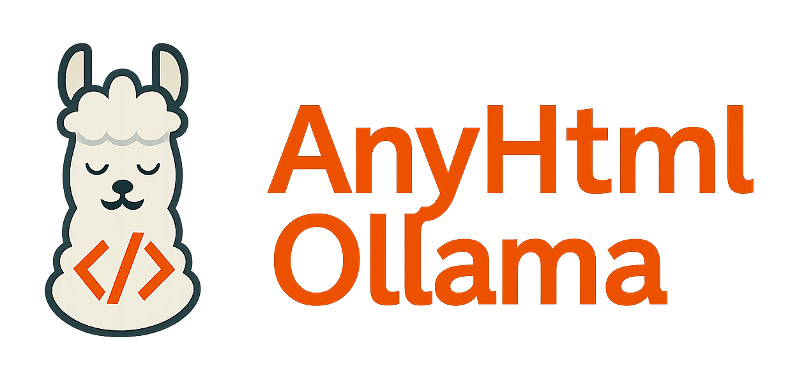
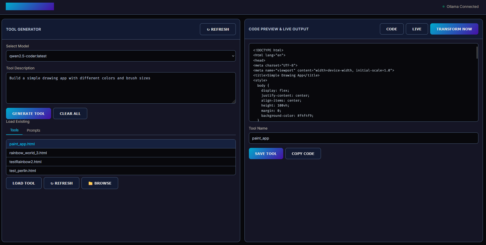
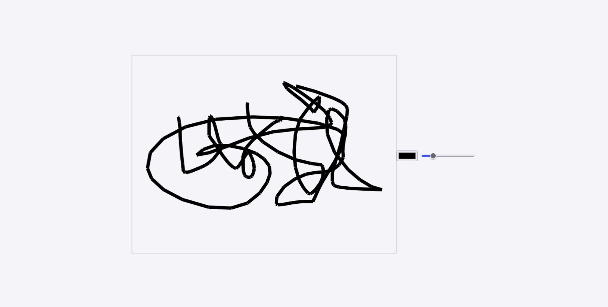

# AnyHtmlOllama

<div align="center">
  
    <h3 style="margin-top:0">Create AI-generated HTML/JS tools using local LLMs</h3>
  <p>A lightweight, browser-based platform for building interactive web tools using Ollama</p>
</div>

## 🚀 Overview

AnyHtmlOllama is a standalone web application that leverages Ollama's local LLMs to generate functional HTML/JavaScript tools directly in your browser. With a simple, intuitive interface, you can prompt the model to create fully interactive web applications without writing code. Perfect for educational purposes, rapid prototyping, or exploring AI capabilities.

The application uses regular expressions to intelligently extract HTML code from Ollama's responses. It first tries to identify code blocks with ```html tags, then falls back to looking for DOCTYPE patterns, ensuring reliable code extraction regardless of how the model formats its output.

- 🔍 **Local AI**: Runs entirely on your machine using Ollama
- 🧩 **Simple Stack**: Pure HTML/JavaScript with a lightweight Python HTTP server (built-in module only)
- 💾 **Save & Reuse**: Save generated tools to reuse or modify later
- 🎮 **Instant Preview**: See your tool in action immediately
- 🌐 **Pure Web Tech**: Uses standard HTML, CSS, and JavaScript

## 🛠️ Installation

### Prerequisites

1. **Ollama**: You need Ollama installed on your system
   - Download from [ollama.ai](https://ollama.ai)
   - Make sure it's running and accessible at http://localhost:11434

2. **Python**: Recommended for the best experience
   - While the app itself is HTML/JavaScript, Python is needed for the local web server
   - Only uses Python's built-in HTTP server module (no additional packages required)
   - The server enables proper file discovery and avoids CORS issues
   - Any recent version will work (3.x recommended)

### Setup

1. **Clone the repository**:
   ```bash
   git clone https://github.com/QuickCoding101/AnyHtmlOllama.git
   cd AnyHtmlOllama
   ```

2. **Run the application**:
   - **Recommended Method**: Use the local web server for full functionality
     - **Windows**: Double-click `start_server.bat`
     - **macOS/Linux**: Run `./start_server.sh` (you may need to `chmod +x start_server.sh` first)
     - Then open your browser to [http://localhost:8000/AnyHtmlOllama.html](http://localhost:8000/AnyHtmlOllama.html)
   - **Alternative**: Open `AnyHtmlOllama.html` directly in your browser (file:// protocol)
     - Note: This method has limitations with file discovery and may encounter CORS issues

## 🧰 Usage

1. **Select a model**: Choose from the available Ollama models (gemma, llama, etc.)
2. **Enter a prompt**: Describe the HTML tool you want to create
3. **Generate**: Click "Generate Tool" and wait for the AI to create your application
   - Behind the scenes, regex patterns extract clean HTML code from the AI's response
   - First tries to match ````html` markdown code blocks
   - Then falls back to matching HTML `<!DOCTYPE...>` patterns if needed
4. **Preview & Adjust**: View the code and live preview, make adjustments as needed
5. **Save**: Give your tool a name and save it for future use

### Example Prompts

- "Create a calculator with a clean, modern design"
- "Make a random password generator with copy-to-clipboard function"
- "Build a simple drawing app with different colors and brush sizes"
- "Create a rainbow animated hello world with a pot of gold"
- "Make a Perlin noise explorer with customizable parameters"

## � Screenshots

### Main Interface

Below is the main interface of AnyHtmlOllama with a prompt to "Build a simple drawing app with different colors and brush sizes":

<div align="center">
  
  <p><em>The main interface showing code generation and preview for a drawing app</em></p>
</div>

### Transformed Tool

After clicking "Transform Now," the generated tool takes over the current page for a full-screen experience:

<div align="center">
  
  <p><em>The drawing app running as a standalone tool after transformation</em></p>
</div>

## �📖 Documentation

For more detailed information, check the docs folder:

- [Complete User Guide](docs/user-guide.md)
- [Understanding the Code](docs/code-explanation.md)
- [How It Works](docs/how-it-works.md)
- [Troubleshooting](docs/troubleshooting.md)
- [Teaching Guide](docs/teaching-guide.md)

## 🔬 Educational Use

AnyHtmlOllama is designed as an educational tool to help students understand:

- AI capabilities and limitations
- LLM prompt engineering
- Front-end web development concepts
- The intersection of AI and coding

## 🤝 Contributing

Contributions are welcome! Feel free to submit issues or pull requests if you have improvements or bug fixes.

## 📄 License

This project is licensed under the MIT License - see the [LICENSE](LICENSE) file for details.

## 🙏 Acknowledgements

- Built using [Ollama](https://ollama.ai/)
- Thanks to all contributors and testers
